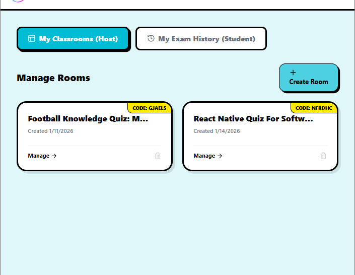
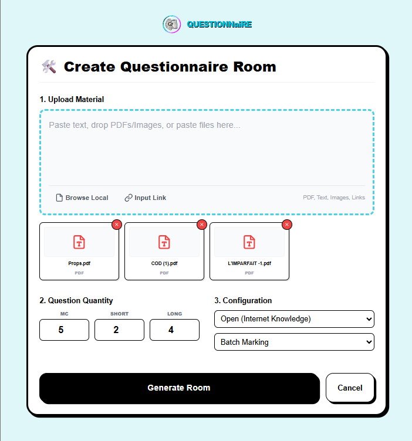
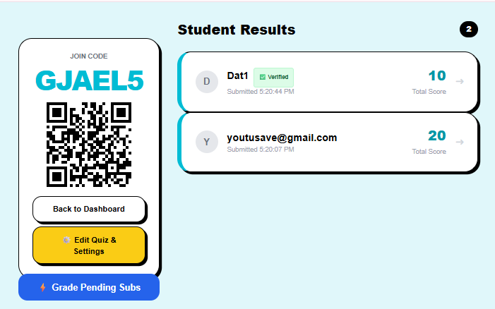
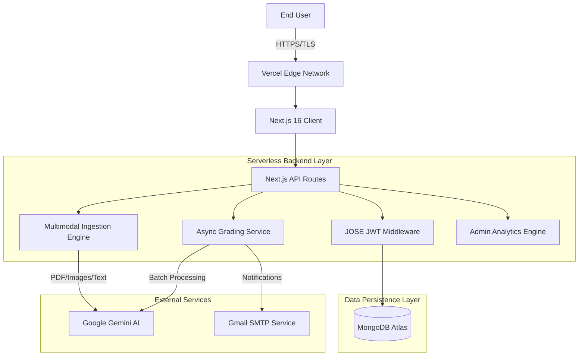
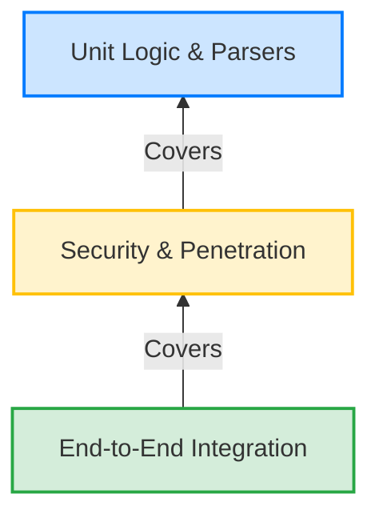
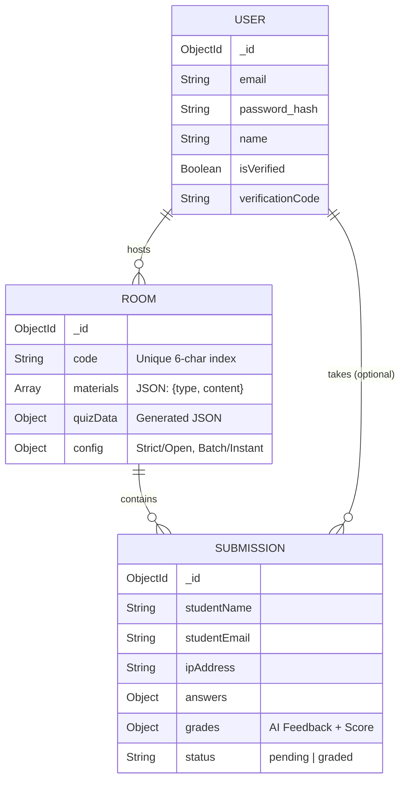

# 🧠 Questionnaire AI

> **📚 Stop Grading. Start Teaching. ✅ The AI-powered assessment platform built with Next.js 16 & Gemini. 🧠✨**


[](https://github.com/dndanny/questionnaire-ai/actions)


---

<br />

## 📸 Project Overview

**Questionnaire AI** solves the "Feedback Lag" in education. It uses Multimodal AI to digest textbooks/PDFs, generate quizzes instantly, and grade students in real-time.

<div align="center">
  
  
  
</div>

<br />

## ✨ Core Features

| Feature | Description | Tech Stack |
| :--- | :--- | :--- |
| **📄 Multimodal Ingestion** | Drag-and-drop PDFs, Images, or paste text. The AI "sees" your content. | Gemini 1.5 Vision |
| **⚡ Hybrid Grading** | Choose **Instant** (Real-time feedback) or **Batch** (Queue 100s of students). | Promise.all / Async |
| **🛡️ Enterprise Auth** | Secure OTP Email Verification & Role-Based Access (Admin/Host/Student). | JOSE JWT + Nodemailer |
| **🎨 Neobrutalist UI** | High-contrast, accessible, and animated interface. | Tailwind + Framer Motion |


---

## 🏗️ System Architecture

The application follows a **Serverless Monolithic** architecture optimized for Vercel/Edge deployment, ensuring low cold-start times and high scalability.

### High-Level Data Flow



---

## 🚀 Key Engineering Features

### 1. Multimodal RAG-Lite Engine
Unlike traditional text-only generators, this engine implements a lightweight Retrieval-Augmented Generation (RAG) approach.
*   **Ingestion:** Accepts Raw Text, Markdown, Images (OCR via Gemini Vision), and PDFs (Native parsing via Base64 streams).
*   **Context Windowing:** Automatically truncates and optimizes token usage to fit within the 1M token context window of Gemini 1.5 Flash / 3.0 Preview.
*   **Prompt Engineering:** Uses "Chain-of-Thought" prompting to enforce strict JSON schema output for reliable parsing.

### 2. Hybrid Grading Architecture (Synchronous vs. Asynchronous)
To handle scale, the system supports two grading strategies configured per-room:
*   **Instant Mode (Synchronous):** The AI grades the submission immediately during the HTTP request. Good for low traffic.
*   **Batch Mode (Asynchronous):** Submissions are queued in MongoDB with a `pending` status. The Host triggers a parallelized batch job (`Promise.all` with concurrency limits) to grade hundreds of students simultaneously in a single AI call, reducing API costs by 90%.

### 3. Security & Identity Management
*   **Role-Based Access Control (RBAC):** Distinct flows for Hosts, Verified Students, Guest Takers, and Super Admins.
*   **Verification:** OTP (One-Time Password) email verification flow with 5-minute expiry windows.
*   **Session Management:** Stateless JWTs via `jose` library for Edge compatibility.

---

## 🧪 Quality Assurance & Testing Strategy

This project maintains a comprehensive test suite covering **Unit**, **Integration**, and **Security** layers, executed via **Jest** and **MongoDB Memory Server**.

### The Testing Pyramid



### Coverage Breakdown (70+ Test Cases)

1.  **Core Logic (Unit Tests):**
    *   AI Response Parsing: Validates handling of malformed JSON, NaN scores, and edge-case text from LLMs.
    *   Auth Utilities: Verifies JWT signing, expiry, and payload integrity.
    
2.  **Security & Edge Cases:**
    *   **IDOR Prevention:** Ensures User A cannot delete User B's rooms.
    *   **Injection Attacks:** Validates input sanitization for large payloads (1MB+ text).
    *   **Role Enforcement:** Verifies Admin routes reject standard user tokens.

3.  **Integration Flows:**
    *   **Full Lifecycle:** Signup -> Verify OTP -> Create Room -> Guest Submit -> AI Grade -> Email Notification.
    *   **Database Constraints:** Verifies uniqueness enforcement (Emails, Room Codes) at the schema level.

---

## 🎨 Design System: "Neo-Educational"

We adopted a **Neobrutalist** aesthetic to maximize accessibility and engagement.

*   **Typography:** High-contrast, sans-serif fonts for readability on low-end devices.
*   **Visuals:** Hard shadows (`box-shadow: 4px 4px 0px 0px #000`), bold borders, and vivid accent colors (Cyan, Yellow, Pink) create a playful yet professional environment.
*   **Feedback:** Optimistic UI patterns provide instant feedback during long-running AI operations.

---

## 🛠️ Tech Stack & Decisions

| Component | Technology | Reasoning |
| :--- | :--- | :--- |
| **Framework** | **Next.js 16.1.1 (Canary)** | Utilizing the latest Turbopack compiler for 10x faster HMR and Server Actions. |
| **UI Library** | **React 19.2.3** | Leveraging new Hooks (`use`, `useActionState`) and Server Components for reduced client-side hydration. |
| **Language** | **TypeScript 5** | Strict type safety to prevent runtime errors in data-heavy AI payloads. |
| **Database** | **MongoDB (Mongoose)** | Flexible schema for storing unstructured JSON quiz data generated by AI. |
| **Styling** | **TailwindCSS** | Utility-first CSS for rapid implementation of the complex Neobrutalist design system. |
| **AI Model** | **Gemini 3 Flash (Preview)** | Chosen for its massive context window (PDF analysis) and low latency compared to GPT-4. |
| **Auth** | **JOSE + BCrypt** | Stateless, edge-compatible JWT authentication without heavy library overhead. |

---

## 💾 Database Schema (Mongoose)



---

## ⚡ Getting Started

### Prerequisites
*   Node.js v20+
*   MongoDB Instance
*   Google Gemini API Key

### Installation

1.  **Clone the repository:**
    ```bash
    git clone https://github.com/dndanny/questionnaire-ai.git
    cd questionnaire-ai
    ```

2.  **Install Dependencies (Legacy Peer Deps required for React 19):**
    ```bash
    npm install --legacy-peer-deps
    ```

3.  **Environment Setup:**
    Create `.env.local`:
    ```bash
    MONGODB_URI=your_mongodb_uri
    GEMINI_API_KEY=your_google_key
    GEMINI_MODEL=gemini-3-flash-preview
    JWT_SECRET=complex_secret
    EMAIL_SERVICE=gmail
    EMAIL_SENDER=your@gmail.com
    EMAIL_PASSWORD=your_app_password
    NEXT_PUBLIC_URL=http://localhost:3000
    ADMIN_EMAIL=your_admin@email.com
    ADMIN_PASSWORD=your_admin_password
    ```

4.  **Run Development Server:**
    ```bash
    npm run dev
    ```
    Access at `http://localhost:3000`.

5.  **Run Test Suite:**
    ```bash
    npm test
    ```

---

## 🔮 Future Roadmap

*   **WebSocket Integration:** Real-time leaderboard updates for live in-class quizzes.
*   **Vector Database (Pinecone):** Switching from context-stuffing to RAG via embeddings for analyzing entire textbooks (1000+ pages).
*   **LTI Integration:** Connectivity with Canvas/Blackboard LMS.

---

## 🤝 Contributing

This project enforces **Strict TypeScript** and **ESLint 9** configurations. Please ensure all PRs pass the build pipeline.

1.  Fork the Project
2.  Create your Feature Branch (`git checkout -b feature/AmazingFeature`)
3.  Commit your Changes (`git commit -m 'Add some AmazingFeature'`)
4.  Push to the Branch (`git push origin feature/AmazingFeature`)
5.  Open a Pull Request

---

*Engineered with ❤️ by Danny*