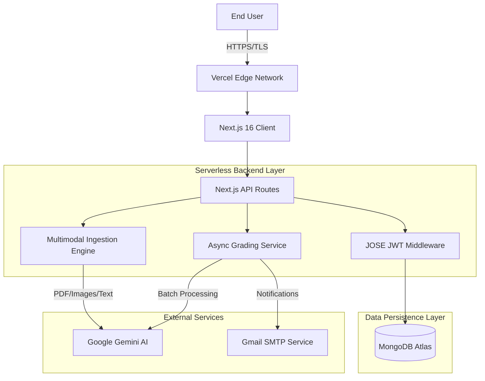
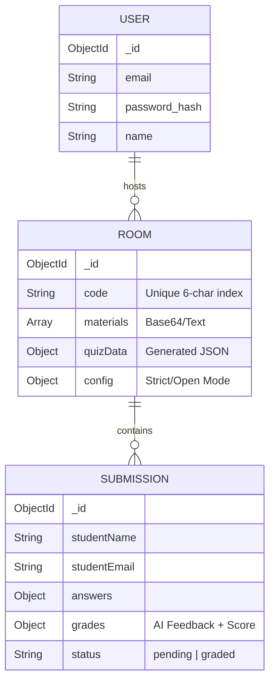

# 🧠 Questionnaire AI

> **An Enterprise-Grade, Multimodal Assessment Platform powered by Next.js 16, React 19, and Gemini AI.**


---

## 📋 Executive Summary

**Questionnaire AI** is a SaaS platform designed to automate the entire lifecycle of educational assessment. It solves the "grading bottleneck" in education by leveraging **Multimodal Generative AI** (Text, Image, PDF) to generate context-aware quizzes and perform human-like grading with detailed feedback.

Built on the bleeding edge of the **React ecosystem (React 19 RC, Next.js 16 Canary)**, it features a **Neobrutalist design system**, **real-time optimistic UI updates**, and a robust **asynchronous batch processing architecture** for high-volume grading.

---

## 🏗️ System Architecture

The application follows a **Serverless Monolithic** architecture optimized for Vercel/Edge deployment, ensuring low cold-start times and high scalability.

### High-Level Data Flow



---

## 🚀 Key Engineering Features

### 1. Multimodal RAG-Lite Engine
Unlike traditional text-only generators, this engine implements a lightweight Retrieval-Augmented Generation (RAG) approach.
*   **Ingestion:** Accepts Raw Text, Markdown, Images (OCR via Gemini Vision), and PDFs (Native parsing).
*   **Context Windowing:** Automatically truncates and optimizes token usage to fit within the 1M token context window of Gemini 1.5 Flash.
*   **Prompt Engineering:** Uses "Chain-of-Thought" prompting to enforce strict JSON schema output for reliable parsing.

### 2. Hybrid Grading Architecture (Synchronous vs. Asynchronous)
To handle scale, the system supports two grading strategies configured per-room:
*   **Instant Mode (Synchronous):** The AI grades the submission immediately during the HTTP request. Good for low traffic.
*   **Batch Mode (Asynchronous):** Submissions are queued in MongoDB with a `pending` status. The Host triggers a parallelized batch job (`Promise.all` with concurrency limits) to grade hundreds of students simultaneously, notifying them via **Nodemailer** upon completion.

### 3. Neobrutalist Design System & Optimistic UI
*   **Aesthetics:** High-contrast, hard shadows, and bold typography (Neobrutalism) for high accessibility and distinct branding.
*   **Tech:** Uses **Framer Motion** for layout transitions and **React 19** primitives for efficient rendering.
*   **UX:** Implements optimistic updates—the UI reflects changes (like editing a grade) immediately while the server validates in the background.

---

## 🛠️ Tech Stack & Decisions

| Component | Technology | Reasoning |
| :--- | :--- | :--- |
| **Framework** | **Next.js 16.1.1 (Canary)** | Utilizing the latest Turbopack compiler for 10x faster HMR and Server Actions. |
| **UI Library** | **React 19.2.3** | Leveraging new Hooks and Server Components for reduced client-side hydration. |
| **Language** | **TypeScript 5** | Strict type safety to prevent runtime errors in data-heavy AI payloads. |
| **Database** | **MongoDB (Mongoose)** | Flexible schema for storing unstructured JSON quiz data generated by AI. |
| **Styling** | **TailwindCSS** | Utility-first CSS for rapid implementation of the complex Neobrutalist design system. |
| **AI Model** | **Gemini 3 Flash (Preview)** | Chosen for its massive context window (PDF analysis) and low latency compared to GPT-4. |
| **Auth** | **JOSE + BCrypt** | Stateless, edge-compatible JWT authentication without heavy library overhead. |

---

## 💾 Database Schema (Mongoose)



---

## ⚡ Getting Started

### Prerequisites
*   Node.js v20+
*   MongoDB Instance
*   Google Gemini API Key

### Installation

1.  **Clone the repository:**
    ```bash
    git clone https://github.com/dndanny/questionnaire-ai.git
    cd questionnaire-ai
    ```

2.  **Install Dependencies (Legacy Peer Deps required for React 19):**
    ```bash
    npm install --legacy-peer-deps
    ```

3.  **Environment Setup:**
    Create `.env.local`:
    ```bash
    MONGODB_URI=your_mongodb_uri
    GEMINI_API_KEY=your_google_key
    GEMINI_MODEL=gemini-3-flash-preview
    JWT_SECRET=complex_secret
    EMAIL_SERVICE=gmail
    EMAIL_SENDER=your@gmail.com
    EMAIL_PASSWORD=your_app_password
    ```

4.  **Run Development Server:**
    ```bash
    npm run dev
    ```
    Access at `http://localhost:3000`.

---

## 🔮 Future Roadmap

*   **WebSocket Integration:** Real-time leaderboard updates for live in-class quizzes.
*   **Vector Database (Pinecone):** Switching from context-stuffing to RAG via embeddings for analyzing entire textbooks (1000+ pages).
*   **LTI Integration:** Connectivity with Canvas/Blackboard LMS.

---

## 🤝 Contributing

This project enforces **Strict TypeScript** and **ESLint 9** configurations. Please ensure all PRs pass the build pipeline.

1.  Fork the Project
2.  Create your Feature Branch (`git checkout -b feature/AmazingFeature`)
3.  Commit your Changes (`git commit -m 'Add some AmazingFeature'`)
4.  Push to the Branch (`git push origin feature/AmazingFeature`)
5.  Open a Pull Request

---

*Engineered with ❤️ by [Your Name]*
